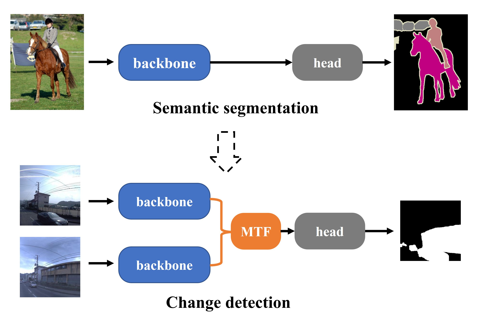
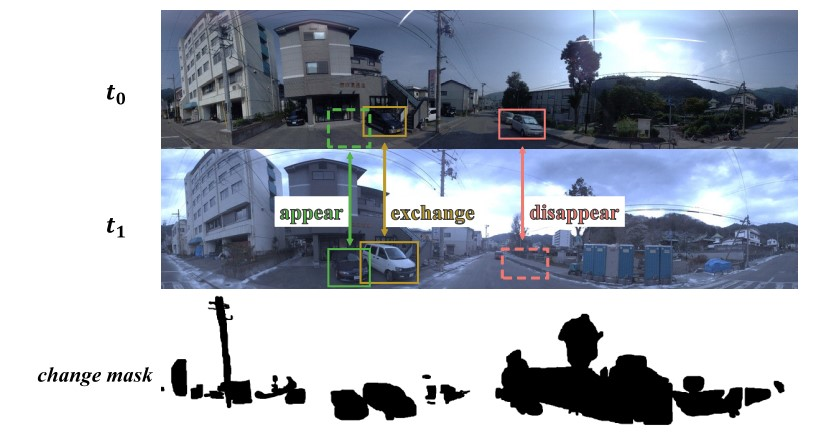
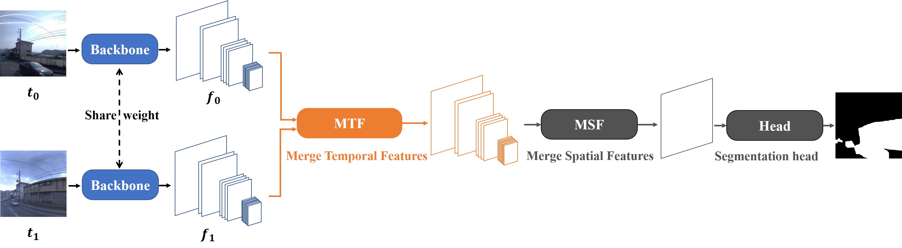
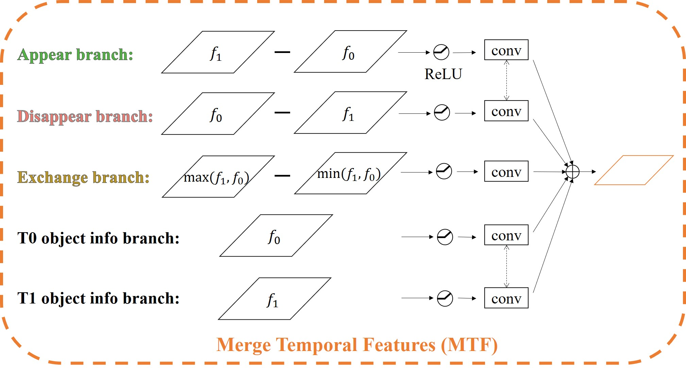
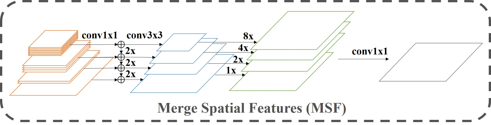
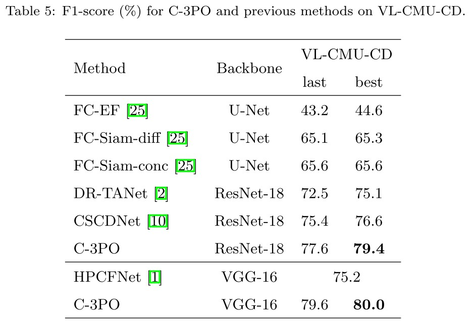
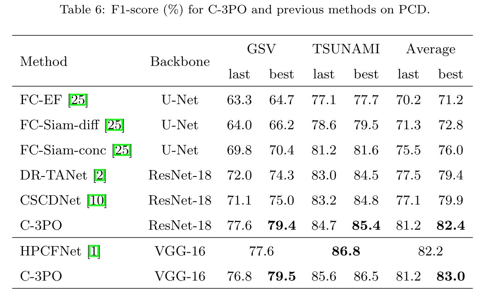
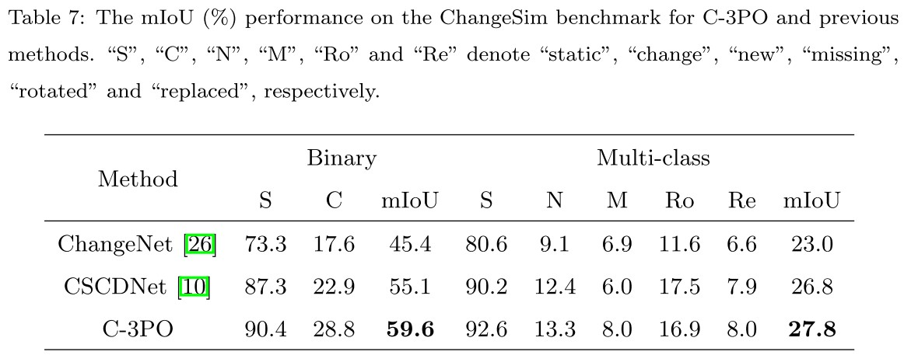

# C-3PO

[](https://paperswithcode.com/sota/change-detection-on-changesim-1?p=how-to-reduce-change-detection-to-semantic)
[](https://paperswithcode.com/sota/change-detection-on-pcd?p=how-to-reduce-change-detection-to-semantic)
[](https://paperswithcode.com/sota/scene-change-detection-on-vl-cmu-cd?p=how-to-reduce-change-detection-to-semantic)

This is the official Pytorch implementation for [How to Reduce Change Detection to Semantic Segmentation](https://arxiv.org/abs/2206.07557). 

Overall, we present a new paradigm that reduces change detection to semantic segmentation which means tailoring an existing and powerful semantic segmentation network to solve change detection.



Our analysis suggests that there are three possible change types within the change detection task and they should be learned separately. Therefore, we propose a MTF (Merge Temporal Features ) module to learn these changes.



We propose a simple but effective network, called C-3PO (Combine 3 POssible change types), detects changes in pixel-level, and can be considered as a new baseline network in this field.







## Features

* This project aims at providing a benchmark of change detection. We implement and include several previous methods in this project, such as `FC-EF`, `FC-Siam-diff`, `FC-Siam-cone`, `DR-TANet`, `CSCDNet`, etc. Please check `src/model` for more details.
* We mainly use the models in torchvision, such as `FCN`, `DeepLab`, etc. This project does not use any other 3rd libraries, such as [mmsegmentation](https://github.com/open-mmlab/mmsegmentation). Hence, this project provides a guidance of how to utilize the torchvision models to efficiently solve other problems.

## Requirements

* Python3
* PyTorch
* Torchvision
* pycocotools
* timm

`Python3`, `Pytorch` and `Torchvision` are necessary. `pycocotools` is required for the `COCO` dataset. `timm` is required for the `Swin Transformer` backbone. 

If you want to use `CSCDNet` in our project, please follow their [instructions](https://github.com/kensakurada/sscdnet) to install the `correlation` module.

If you do not want to use other models or install unnecessary packages, please checkout the `mini` branch, which only contains codes for our C-3PO model.

## Prepare the dataset

There are three datasets needed in this projects:
* COCO
* PCD
* VL-CMU-CD
* ChangeSim

Please refer to `src/dataset/path_config.py` to understand the folder structure of each dataset. And edit `data_path` according to your system.

Please follow this [site](https://kensakurada.github.io/pcd_dataset.html) to download the PCD dataset. You may need to send e-mails to Takayuki Okatani.

For VL-CMU-CD, you can check this [issue](https://github.com/gmayday1997/SceneChangeDet/issues/7). Or you can download `VL-CMU-CD-binary255` at [here](https://huggingface.co/datasets/Flourish/VL-CMU-CD/blob/main/VL-CMU-CD-binary255.zip). Overall, I am not sure if I can release this dataset. If there is a policy problem, please contact me. And I will delete it.  

Please follow this [page](https://github.com/SAMMiCA/ChangeSim) to prepare the ChangeSim dataset.

## Run

**training**
```
python3 -m torch.distributed.launch --nproc_per_node=4 --use_env src/train.py --train-dataset VL_CMU_CD --test-dataset VL_CMU_CD --input-size 512 --model resnet18_mtf_msf_fcn --mtf id --msf 4 --warmup --loss-weight
```

**testing**
```
python3 src/train.py --test-only --model resnet18_mtf_msf_fcn --mtf id --msf 4 --train-dataset VL_CMU_CD --test-dataset VL_CMU_CD --input-size 512 --resume [checkpoint.pth]
```

We provide all shells to reproduce the results in our paper. Please check files in the `exp` folder. You can use below commands to run experiments.

```
source exp/sota/resnet18_mtf_id_msf4_deeplabv3_cmu.sh
train
```

### Pretrained Weights

Please download the weights by yourself. Check the `test` command in the shell, and modify `--resume` according to your download path. Then you can run the `test` command to evaluate the performance.

| Shell | Weights | Model | Dataset | Performance |
| :---: | :---: | :---: | :---: | :---: |
| [resnet18_mtf_id_msf4_deeplabv3_cmu](exp/sota/resnet18_mtf_id_msf4_deeplabv3_cmu.sh) | [resnet18_id_4_deeplabv3_VL_CMU_CD.pth](https://huggingface.co/Flourish/C-3PO/blob/main/resnet18_id_4_deeplabv3_VL_CMU_CD.pth) | resnet18_mtf_msf_deeplabv3 | VL-CMU-CD | 79 |
| [vgg16bn_mtf_id_msf4_deeplabv3_cmu](exp/sota/vgg16bn_mtf_id_msf4_deeplabv3_cmu.sh) | [vgg16bn_id_4_deeplabv3_VL_CMU_CD.pth](https://huggingface.co/Flourish/C-3PO/blob/main/vgg16bn_id_4_deeplabv3_VL_CMU_CD.pth) | vgg16bn_mtf_msf_deeplabv3 | VL-CMU-CD | 80 |
| [resnet18_mtf_iade_msf4_deeplabv3_pcd](exp/sota/resnet18_mtf_iade_msf4_deeplabv3_pcd.sh) | [resnet18_iade_4_deeplabv3_PCD.pth](https://huggingface.co/Flourish/C-3PO/blob/main/resnet18_iade_4_deeplabv3_PCD.pth) | resnet18_mtf_msf_deeplabv3 | GSV/TSUNAMI set 0 | 80/88 |
| [vgg16bn_mtf_iade_msf4_deeplabv3_pcd](exp/sota/vgg16bn_mtf_iade_msf4_deeplabv3_pcd.sh) | [vgg16bn_iade_4_deeplabv3_PCD.pth](https://huggingface.co/Flourish/C-3PO/blob/main/vgg16bn_iade_4_deeplabv3_PCD.pth) | vgg16bn_mtf_msf_deeplabv3 | GSV/TSUNAMI set 0 | 79/88 |
| [resnet18_mtf_iade_msf4_deeplabv3_changesim_binary](exp/changesim/imagenet_resnet18_mtf_iade_msf4_deeplabv3_changesim_binary.sh) | [resnet18_iade_4_deeplabv3_ChangeSim_Binary.pth](https://huggingface.co/Flourish/C-3PO/blob/main/resnet18_iade_4_deeplabv3_ChangeSim_Binary.pth) | resnet18_mtf_msf_deeplabv3 | ChangeSim Binary | 60 |
| [resnet18_mtf_iade_msf4_deeplabv3_changesim_multi](exp/changesim/imagenet_resnet18_mtf_iade_msf4_deeplabv3_changesim_multi.sh) | [resnet18_iade_4_deeplabv3_ChangeSim_Multi.pth](https://huggingface.co/Flourish/C-3PO/blob/main/resnet18_iade_4_deeplabv3_ChangeSim_Multi.pth) | resnet18_mtf_msf_deeplabv3 | ChangeSim Multi | 28 |


Note that the PCD dataset has 5 subsets, and we release our models for the first subset. Please train models on other subsets by yourself if you want to obtain them.

## Results

As stated in our paper, VL-CMU-CD and PCD suffer from noisy labels. We present the last and the best performance for reference. Overall, it is easy to achieve the performance between these two scores. 







## Visualization


## Citation

If you find the work useful for your research, please cite:

```
@article{wang2022c3po,
  title={How to Reduce Change Detection to Semantic Segmentation},
  author={Wang, Guo-Hua and Gao, Bin-Bin and Wang, Chengjie},
  journal={Pattern Recognition},
  year={2023}
}
```

## reference

* https://github.com/pytorch/vision/tree/main/references/segmentation
* https://github.com/kensakurada/sscdnet
* https://github.com/rcdaudt/fully_convolutional_change_detection
* https://github.com/leonardoaraujosantos/ChangeNet
* https://github.com/SAMMiCA/ChangeSim

